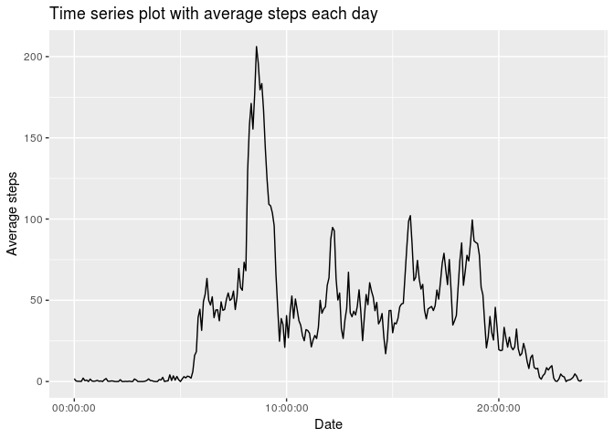
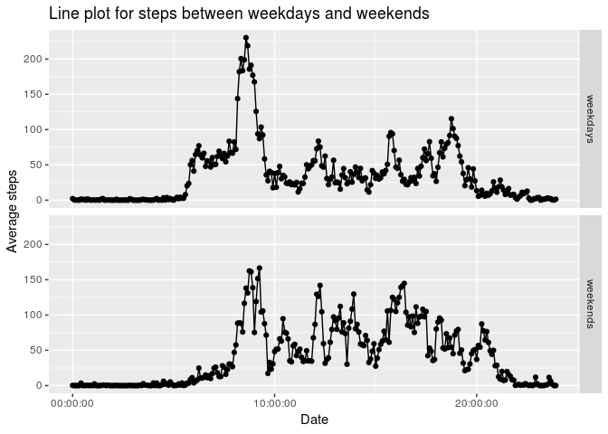

## 1. Loading and preprocessing the data

1. load package including readr, tidyr, dplyr etc.  
2. unzip activity.zip  
3. read activity.csv and preprocessing data


```r
## load package
library(readr)
library(tidyr)
library(dplyr)
library(lubridate)
library(ggplot2)
library(stringr)
library(mice)
library(magrittr)

## load data and create new variables including time, datetime, weekends etc 
unzip('activity.zip')
dataset <- read.csv('activity.csv', header = T) %>% 
        mutate_at('interval', funs(as.character)) %>% 
        mutate(time = case_when(
                interval == '0' ~ '000',
                interval == '5' ~ '005',
                interval == '10' ~ '010',
                interval == '15' ~ '015',
                interval == '20' ~ '020',
                interval == '25' ~ '025',
                interval == '30' ~ '030',
                interval == '35' ~ '035',
                interval == '40' ~ '040',
                interval == '45' ~ '045',
                interval == '50' ~ '050',
                interval == '55' ~ '055',
                TRUE ~ interval
        )) %>% 
        mutate(time = str_c(str_sub(time, start = 1, end = -3), ':', str_sub(time, -2), ':00')) %>% 
        mutate(datetime = ymd_hms(str_c(date, time, sep = ' '))) %>% 
        mutate(time = hms::as.hms(time)) %>% 
        mutate(date = ymd(date)) 
```


## 2. What is mean total number of steps taken per day?  

For this part of the assignment, you can ignore the missing values in the dataset.  

1. Calculate the total number of steps taken per day  
2. Make a histogram of the total number of steps taken each day  
3. Calculate and report the mean and median of the total number of steps taken per day  

### 2.1 Histogram of the total number of steps taken each day  

```r
p <- dataset %>% 
        group_by(date) %>% 
        summarise(total = sum(steps)) %>% 
        ggplot() +
        geom_histogram(aes(total), bins = 10) +
        labs(title="Histogram with total steps each day", x = 'Date', y= 'Total steps')
p %>% ggsave(filename = "instructions_fig/Histogram with total steps each day.png", device = 'png')
```

```
Warning: Removed 8 rows containing non-finite values (stat_bin).
```

```r
print(p)
```

```
Warning: Removed 8 rows containing non-finite values (stat_bin).
```

<!-- -->

### 2.2 Mean and median number of steps taken each day  

```r
dataset %>% 
        group_by(date) %>% 
        summarise(total = sum(steps)) %>% 
        summarise(mean = mean(total, na.rm = T), 
                  median = median(total, na.rm = T))
```

```
# A tibble: 1 x 2
    mean median
   <dbl>  <int>
1 10766.  10765
```

## 3. What is the average daily activity pattern?  

1. Make a time series plot (i.e. type="l") of the 5-minute interval (x-axis) and the average number of steps taken, averaged across all days (y-axis)  
2. Which 5-minute interval, on average across all the days in the dataset, contains the maximum number of steps?  


### 3.1 Time series plot of the average number of steps taken  

```r
p <- dataset %>% 
        group_by(time) %>% 
        summarise(mean = mean(steps, na.rm = T)) %>% 
        ggplot() +
        geom_line(aes(x = time, y = mean)) +
        labs(title="Time series plot with average steps each day", x = 'Date', y= 'Average steps')
p %>% ggsave(filename = "instructions_fig/Time series plot with average steps each day.png", device = 'png')
print(p)
```

<!-- -->

### 3.3 The 5-minute interval that contains the maximum number of steps  

```r
dataset %>% 
        filter(steps == max(steps, na.rm = T)) %>% 
        pull(datetime)
```

```
[1] "2012-11-27 06:15:00 UTC"
```


## 4. Imputing missing values  

1. Calculate and report the total number of missing values in the dataset (i.e. the total number of rows with NAs)   
2. Devise a strategy for filling in all of the missing values in the dataset.  
3. Create a new dataset that is equal to the original dataset but with the missing data filled in.  
4. Make a histogram of the total number of steps taken each day and Calculate and report the mean and median total number of steps taken per day.  

### 4.1  Total number of missing values  

```r
md.pattern(dataset)
```

<!-- -->

```
      date interval time datetime steps     
15264    1        1    1        1     1    0
2304     1        1    1        1     0    1
         0        0    0        0  2304 2304
```

### 4.2  Imputing missing data and create new dataset  

```r
## imputed NA by using mean 
dataset_imputed <- dataset %>% 
        group_by(time) %>% 
        mutate(mean = round(mean(steps, na.rm = T), 0)) %>% 
        mutate(steps = ifelse(is.na(steps), mean, steps))
```

### 4.3  Histogram of the total number of steps taken each day with NA imputed  

```r
p <- dataset_imputed %>% 
        group_by(date) %>% 
        summarise(total = sum(steps)) %>% 
        ggplot() +
        geom_histogram(aes(total), bins = 10) +
        labs(title="Histogram with total steps each day after imputed for NA", x = 'Date', y= 'Total steps') 
p %>% ggsave(filename = "instructions_fig/Histogram with total steps each day after imputed for NA.png", device = 'png')
print(p)
```

<!-- -->

### 4.4  Mean and median total number of steps taken per day

```r
dataset_imputed  %>% 
        group_by(date) %>% 
        summarise(total = sum(steps, na.rm = T)) %>% 
        summarise(mean = mean(total, na.rm = T), 
                  median = median(total, na.rm = T))
```

```
# A tibble: 1 x 2
    mean median
   <dbl>  <dbl>
1 10766.  10762
```


## 5. Are there differences in activity patterns between weekdays and weekends?  

1. Create a new factor variable in the dataset with two levels – “weekday” and “weekend” indicating whether a given date is a weekday or weekend day.  
2. Make a panel plot containing a time series plot (i.e. type="l") of the 5-minute interval (x-axis) and the average number of steps taken, averaged across all weekday days or    weekend days (y-axis).  


### 5.1 Create a new dataset with weekends variable

```r
dataset_imputed <- dataset_imputed %>% 
        mutate(wday = wday(date, label = T)) %>% 
        mutate(weekends = case_when(
                wday == 'Sun' ~ 'weekends',
                wday == 'Sat' ~ 'weekends',
                TRUE ~ 'weekdays'))
```

### 5.2 Create a new dataset with weekends variable   

```r
p <- dataset_imputed %>% 
        group_by(weekends, time) %>% 
        summarise(mean = mean(steps)) %>% 
        ggplot() +
        geom_point(aes(x = time, y = mean)) +
        geom_line(aes(x = time, y = mean)) +
        facet_grid(weekends ~ . ) +
        labs(title="Line plot for steps between weekdays and weekends ", x = 'Date', y= 'Average steps')
p %>% ggsave(filename = "instructions_fig/Line plot for steps between weekdays and weekends.png", device = 'png')
print(p)
```

<!-- -->


